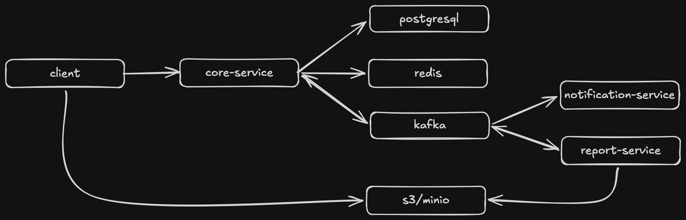

# Timer Backend

Timer Backend is a event-driven microservices architecture designed for a time-tracking application.
It allows users to track their activities, manage labels for categorization, and customize their timer settings.

## System Architecture



The application consists of three following services:

* **Core Service**: The primary service that manages core business logic, persists user and timer 
data in **PostgreSQL**, leverages **Redis** for caching and publishes event messages to **Kafka**.
* **Notification Service**: A consumer that listens to Kafka events to send notifications to users.
* **Report Service**: Listens to Kafka events to generate report files and uploading them to **S3/MinIO**.

## 🚀 Features

- **User Authentication**: Secure registration and login using JWT.
- **Time Tracking**: Create, update, and manage timer entries with start times, end times, and durations.
- **Label Management**: Categorize your timer entries with custom labels.
- **Timer Settings**: Personalize your timer experience with user-specific settings and options.
- **Data Export/Import**: Export your timer history to CSV and import it back when needed.
- **Rate Limiting**: Protected API abuse with built-in rate limiting.
- **API Documentation**: Interactive API documentation with Swagger/OpenAPI.
- **Database Migrations**: Reliable database schema management using Liquibase.

## 🛠 Tech Stack

- **Framework**: Spring Boot 4.x
- **Language**: Java 17
- **Database**: PostgreSQL
- **Messaging**: Kafka
- **Storage**: MinIO (S3-compatible)
- **Database Migration**: Liquibase
- **Security**: Spring Security + JWT
- **API Documentation**: SpringDoc OpenAPI (Swagger UI)
- **Utilities**: Lombok, MapStruct, OpenPDF, 
- **Testing & Quality**: Mockito, Junit, Testcontainers, REST Assured, Jacoco, Checkstyle
- **Containerization**: Docker

## 🐳Run with Docker Compose
To spin up the entire microservices ecosystem, run:
```bash
docker-compose up --build
```

## 📚 API Documentation

Once the application is running, you can access the [interactive Swagger UI](http://localhost:8080/swagger-ui/index.html).
